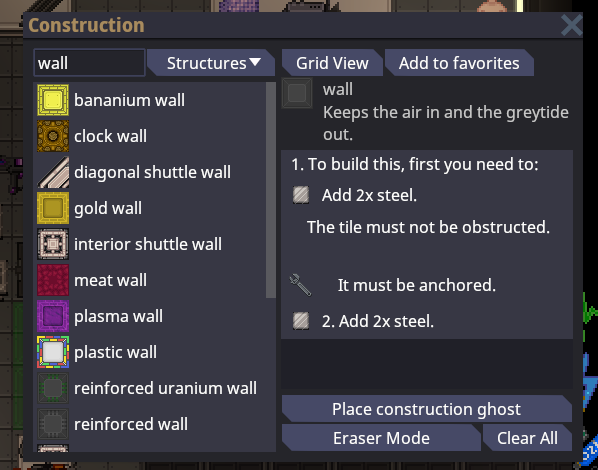
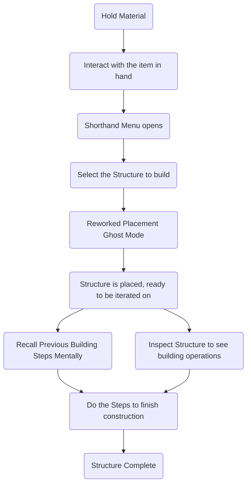
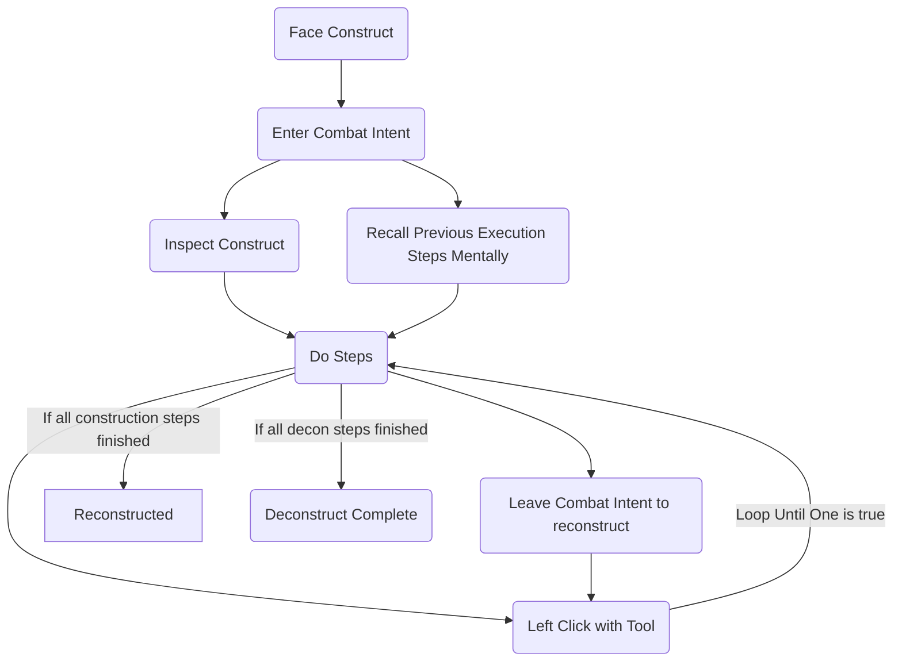

# Construction and Deconstruction Rework

| Designers | Implemented | GitHub Links |
|-----------|---|---|
| Tojo      | :x: No | TBD |

## Overview

This design document is intended to define the plans for a rework of the station construction system, including creation of computers, machines, walls, tables, chairs, windows, directional windows, airlocks, windoors, and more. 

Consequently, it requires the rework of the deconstruction system.

## Background

To preface this, I am a SS13 player who has recently moved to SS14 and is a bit surprised at the stilted functionality of quite a few systems and mechanics. Space Station 13 is generally known as a very awkward game to play for newcomers, however I've strangely found Space Station 14 to be far more awkward in many scenarios.

All of my PRs before this have been directly written to target gripes I've had, such as floor sprites, lack of emote text bubbles, and the outdated hurt overlay functionality.

That's where this design comes in. After having experimented with the SS14 construction system, I've found it to be rather inadequate in both UX and UI; It being a mix of several building concepts from games haphazardly mixed in an attempt to streamline the system. 

How does construction currently work?

In my opinion it does this quite poorly. The current system, which I'll refer to as 'SS14Construction' to avoid repeating current system constantly, consists of a tucked away construction masterlist with no true form of visual sorting. It is a cluttered menu that does not attempt to separate what you are likely to build with it from what you'll only build once.

One rework we could do to the SS14Construction system would be to redo this user interface. That would also be an inadequate rework. Along with the inefficient menu, placing an item consists of clicking the item and placing a ghost. You must then cancel ghost-placement mode by right-clicking. This seems inspired by Fallout-4-esque systems.

In Fallout 4, you place structures, such as a shack wall, onto a foundation by looking at it, aligning the ghost with the foundation, and letting it snap to the sides. You press your action button, and it places the item in it's entirety. There is nothing else you must do to it.

This is not how our system works. Instead, you, only now, are able to construct the item vaguely similar to SS13. You inspect the ghost to see the recipe. You see the materials, then you click it with the materials in-hand. While the ghost you applied will generally be explained to you via the inspection menu, you may also ignore the inspection menu entirely, choosing to build items with common intermediary types, such as Girders > Walls.

This is poorly designed. In an attempt to be a streamlining of the SS13 system, it has added many extra clicks and string searches to place a single wall. It does not inherently solve the issues that plagued the SS13 system for beginners, such as requiring a Wikipedia panel open for many items. This is not 'QOL Slop', but rather a bad middle ground between a brand-new system and a tried and true system.

In SS13, to construct a structure, you would take a material in-hand and find the 'base construction component' in a compact, sorted with drop-downs, menu. To construct a wall, you required 'wall girders'. Selecting Wall Girders would place a set of girders at your feet, consuming the materials in the process. Wrenching the girders onto the ground would prevent them from moving, being secured to the grid and being see-through. They provide no atmospheric protection, but do work quite well against tiding, un-tooled assistants.

Once your girders are secured to the floor, you will notice the holdovers SS14Construction keeps while failing to streamline. Inspecting your girders will let you know that they can be unsecured, welded apart back into materials, and built upon with any material. Let's say you're basic and want to build a standard wall. You place iron onto the wall, and congratulations! You have a wall. An exact analogue to the SS14Construction post-ghost system.

The menu itself is inherently better. You are limited to the constructs that your current held material can produce, keeping 'pizza walls' out of your menu when you are holding wood. With the dropdown sorting of types with variations, it condenses another issue the SS14Construction menu has, that being the alphabetical order. 

Alphabetical order may seem logical, but we do not do this with most things for a reason. Alphabetical order is a system where you are inspired to scroll to find your letter in order to locate your entry. This banishes later-alphabetical characters to the depths of the menu, past the 'clockwork' variants at C and the 'directional' variants at D, past the curbs and the airlocks, to find your desired build.

Of course, you can also go to the top of your window to string-search for your construction, requiring those who do not single-handed peck-type to remove a hand from the mouse and place it onto the keyboard to type. This is a **UX nightmare.**

Oh, and, fuck you. Scroll past every variant of wall to find the base type of wall as it is alphabetically last.

How does deconstruction currently work?

Deconstruction as it currently stands is also a UX nightmare. 

To start a deconstruction job, the user must singlehandedly rightclick the construction to enter 'deconstruction mode', a mode which allows the user to use tools on the selected construct. It highlights the steps to deconstruct within the inspect menu, requiring a shift click to see it. That's quite a few clicks to initiate construction.

Beyond clicks, the issues begin to compound with the networking replication lag that comes with asking the server if we can do something without trying to figure it out on our own client before asking the server if we **really can.** The deconstruction entry pops up **after** a few milliseconds, adding yet another hiccup to the process, with visual pop-in on a UI element that you have to locate with the cursor to click.

Good. We've now entered the mode, in the very least. If we initiated this on a currently-constructing object, it will inform you 'To deconstruct: '

Nothing, it says nothing. Why does it say nothing? Because it's not constructed yet. You must complete the construction to deconstruct. You cannot undo your previous action. A headache if you've been told to not do something, or interrupted **John Tider** from building a reinforced wall in front of you. Enjoy finishing the wall to break it down!

Okay, sure. Let's say you're breaking a finished wall. You follow the instructions for a reinforced-wall destruction halfway, before your Chief Engineer tells you that you need not break this wall, and to fix what you broke. You can't. Get your wirecutters out, you're breaking it down before you can rebuild it. And **you better hope you aren't told to take it down instead during this.**

The system has a lack of bidirectionality support, a symptom of not thinking of edge scenarios where something might not be as smooth as you initially intended it to feel. Additionally, it consistently adds _more_ clicks than the previous system with absolutely zero benefit.

## A Redesign

### Core Principles

The core principles of a construction rework should improve in 3 key areas. **Fewer clicks**, **intuitive common-sense design**, and **bidirectionality**.

Fewer clicks should achieve less hand-movement per action to reduce the amount of time in menus and increase the amount of time spent in the round roleplaying.

Intuitive common-sense design should be achieved

### Construction

#### Interaction Flow

#### Steps Explained
##### Hold Material

Take the item into your hands. If not hands, you cannot build.

##### Interact with the item in-hand

Click the icon of the item on your hotbar or hit Z to open the Shorthand Menu.

This addresses the 'Fewer Clicks' principle by acting as an inherent filter, populating a list strictly based on what the item can create, reducing list population.
 

##### Shorthand Menu Opens

You will see a hierarchical categorized menu, with the most common and abstract recipes sorted near the top, with the rarer and more specific items further down the list, sorted into specificity dropdown in the scenario of variants.

The top items will include _Airlock Assembly_, _Wall Girder_, _Table Frame_, _Iron Rods_, _Machine Frames_, _Computer Frames_, and _Closets_.

##### Placement Ghost Mode

Reworking the previous 'ghost mode', we will now simply immediately begin constructing the placed ghosts, allowing multiple to be constructed at a time. This is possible in SS13 as well, yet you must place the girders first and then do all adjacent tiles at once.

##### Structure is Placed

This is done for precision, allowing the builder to confidently place girders quickly. If the structure has 'subtypes', this is where they will be handled. An example is that Girders can construct RWalls and Walls.

##### Inspect Structure

Upon inspection, the player will see construction dialogue. If in deconstruction mode, the player will also see a second set of bidirectional deconstruction instructions.

##### Steps

Do the steps iteratively, allowing bidirectionality at every step. Ideally, underneath, steps will be defined by a new structure with possible tool interactions and their registered functions.

YAML or hard-defined? I'm unsure. I'm open to suggestions.
### The Shorthand Menu.

Pictured above is a UI Mockup created in Affinity Designer, activated upon interacting in-hand with the material.

The UI a fuzzy search, stackable tabs, compact design listings, favorites, and a 'common' design list.

The common design list shall appear on materials with a YAML registered defining the material's most common recipes. 

In the scenario of a lack of a YAML definition for the material's common recipes, the page will default to 'All' on opening. This highly accelerates searching, reducing scrolling and typing completely.

The material selected will be used as the 'filter' for constructs, where only steel-only constructs will appear in the recipe list for iron, as an example.

### Deconstruction

#### Interaction Flow

#### An Important Debate

Swapping tools to having Combat Intent-dependent construction steps will require flavor interactions between deconstructables and their tools to no-longer function mechanically. In the past, these tools could be used on harm-intent to swing at walls, dealing no damage and simply being for flavor. 

As is tradition, once a input-mapping conflict arises, we will need to resolve it. One input set needs to change consequently. One interaction will either need to be stilted, or to be completely removed. Of course, stilting deconstruction is what we currently do in order to keep these 'flavor interactions.' 

As was explained in SS14Construction's critique portions, the deconstruction interaction is inherently flawed, a user experience nightmare. We must decide on a way to correct this. I advocate to simply remove this minimal-flavor feature of specific tools being able to hit walls, and deferring them to roleplay emotes.

Freeing their actions to a new 'Intent Specific Interaction' when the construct has an available interaction in Combat Intent to deconstruct will add an intuitive interaction between tools and constructs.

##### Why should we?

Put simply, it is worth losing a minimal flavor interaction without any mechanical uses in specific scenarios if it completely revamps the UX of the deconstruction system. We lose nothing by asking players to simply do this with emotes if they're so desperate to hit the wall with a screwdriver. Additionally, things like walls will not be interactable via screwdriver, and instead require a Welder to return it back to Girder form. From there, the Girder can be unwelded to be turned into material and unwrenched to be unsecured from the floor.

## Game Design Rationale

### Seriously Silly

While not an inherently silly feature, it allows for more to happen as less time will be spent fumbling through stilted UX design to create building designs to setup interactions.

### There is no Winning or Losing

There is no Winning and Losing with User Experience design. This does not inherently affect the combat loop, however it comes into place in one key scenario.

The interruption. 

During construction or deconstruction, there currently is not any way to reverse a step. Once a step has been executed, you must wrap back around to undo what you have done by finishing the construct before being able to deconstruct, and vice versa. While remaining a UX issue, it would effect this specific scenario. A Security Officer will be able to demand a criminal to no-longer break down a wall, and they will be able to repair the damage done without looping back around.  

This is an inherently good change in that regard.

### Maintaining Authenticity

Here's the big one. Common-sense design philosophy that you can intuit is widely covered by this core principle. It is far more authentic to be able to look at a wall and simply begin unwelding it than flagging it for deconstruction before being able to proceed. Likewise, it is far more authentic to be able to reapply the screws once unscrewing a window, rather than destroying the window to put the screws in in-order.

### Take Things Slow

Fumbling with UX is not a good example of a feature intentionally added to slow players down. The system is intended to streamline the SS14Construction system, using its strengths while reintroducing SS13 concepts where necessary when it would be a better design. 

The speed of deconstructing and constructing walls is not inherently changed with this system. Simply the speed of the fumbling with the UI.

### Maximizing Roleplay Potential

_"If it does take away, is it a positive change in the long run?"_

In exchange for losing a simple flavor interaction on compatible constructs, the tradeoff is a far more streamlined design, allowing players to functionally interact with their environment in a natural, authentic, and intuitive way. Additionally, as previously mentioned, this does not affect incompatible constructs, such as a _wall with a screwdriver_, or a _computer with a welder_.