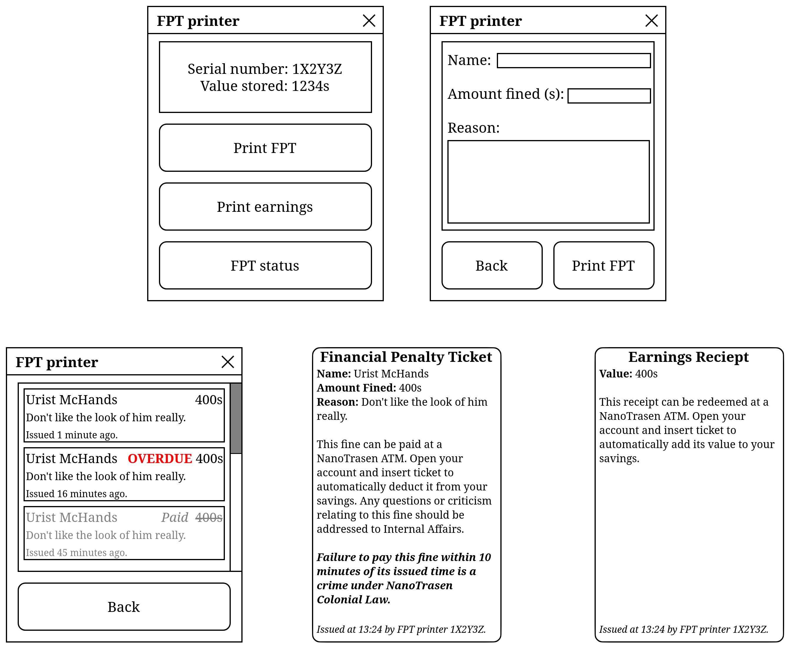
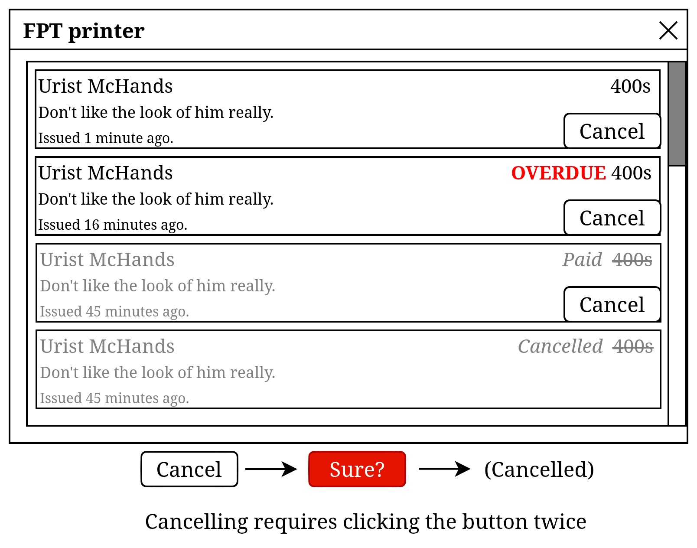

# Internal Affairs & Security

| Designers | Implemented | GitHub Links |
|---|---|---|
| pirakaplant, ferynn | :warning: Partially | https://github.com/funky-station/forky-station/pull/280 https://github.com/funky-station/forky-station/pull/285 |

## Overview

This is an outline for several closely related concepts that rely on each other. First, it re-contextualises what were previously CCVIP duties (SOP and trials) into a department below Command. Second, it splits Security off from the rest of the station's structure and alters how Security itself is structured. Third, it makes several other changes related to how these departments interact. Finally, it gives both departments new equipment to help them perform their duties.

## Background

[One of the directives the SOP workgroup was given by taydeo was to separate Security from the station's command structure.](https://discord.com/channels/1276640157511979008/1484259495130566656/1496704770407137410) Over time, this idea was expanded into making Security a wholly different company from NanoTrasen Incorporated. Its structure was also scrutinised, initially putting more of a focus on the organisation of the department on the HOS (from the viewpoint that the game currently puts a lot of the responsibilities of managing the department on the Warden). These two directions have culminated in [an official Security structure by ferynn](https://discord.com/channels/1276640157511979008/1484259495130566656/1534722931345592382) that exists independently of NanoTrasen. This document includes this structure and covers the details relating to it.

One of the issues with SOP on the original Funky codebase was that it was enforced by Central Command VIPs. Several factors in how they were presented (their name, clothing, unique bureaucratic powers they had outlined in the guidebook, etc.) lead to players viewing them as an IC authority greater than the Captain, an OOC force to be obeyed, or both. According to a survey conducted on the Discord, [58% of Captain players felt they would face admin punishment if they went against a CCVIP](https://discord.com/channels/1276640157511979008/1297622994222321684/1498356678813548636), and [85% of people who play heads of staff felt the CCVIPs had more power than them](https://discord.com/channels/1276640157511979008/1297622994222321684/1498356751739785226). The SOP workgroup decided on moving the Internal Affairs Agent and Magistrate to a new department (called Legal and later Internal Affairs) under the Head of Personnel (or Executive Officer), and moving the NanoTrasen Representative (or Corporate Liason) to an advisory position for command that represents Central Command but does not hold any authority in the station's command structure. This document focuses on the Internal Affairs aspect of this restructuring.

## Features to be added

### Contracted Security

Rather than being a part of NanoTrasen Inc., Security is now canonically a force from a separate company called Aegis Security Consolidated (ASC). They are hired by NT to provide protection and enforcement on the station. This is more than just a flavour change, and comes with considerable changes to gameplay.

#### Commandant

The Commandant is a job that replaces the Head of Security as the job in charge of the Security department. Unlike the Head of Security, the Commandant is *not* a member of Command, does *not* have Command radio or Bridge access, and their knowledge of antagonists is limited to the [Security Training Manual](#security-training-manual). They are specifically responsible for the following:

- Training Cadets (or assigning them to someone else willing to train).
- Assigning Security Officers and Cadets to Lieutenants.
- Ensuring that the [arrest quota](#arrest-quota) is met (which involves keeping a record of all arrests).
- Communicating concerns and requests with the Executive Officer (such as permission to order gear on the [INT budget](#int-budget)).

The Commandant starts with most of the HOS's equipment, albeit renamed to replace "HOS" and "head of security" with "commandant". However, they start with the [commandant's energy cutlass](#energy-cutlasses) and a [ME-55 pistol](#laser-pistols) instead of the energy magnum or WT-550. They also have a [VAM-04 loudspeaker](#vam-04-loudspeaker). A copy of the [Security Training Manual](#security-training-manual) can be found in their locker.

Under the contract, the Commandant answers to the Captain.

#### Warden

The Warden reprises their role as the manager of prisoners, but overseeing manual labour rather than the brig. They can draft aid from Security Officers and Cadets as needed.

In terms of uniform and equipment, they are unchanged other than gaining a [VAM-04 loudspeaker](#vam-04-loudspeaker).

The Warden answers to the Commandant, as they did to the HOS.

#### Lieutenant

Lieutenants order around squads of Security Officers and Cadets in the field. On smaller maps, there is only a single Lieutenant slot, but larger maps can have up to two or even three Lieutenants in play.

Lieutenants are equipped similarly to Security Officers (including a bodycam and FPT printer) but carry an [energy cutlass](#energy-cutlasses) and [SEARcH blaster](#laser-pistols) instead of a sidearm. They also have a red whistle and a [VAM-04 loudspeaker](#vam-04-loudspeaker).

Lieutenants have their own hardsuits that are more resilient, but reduce speed slightly more.

In terms of uniform, Lieutenants have the same options as Security Officers but have a lieutenant's badge and a distinctive hat to set them apart from their subordinates.

Lieutenants answer to the Commandant.

#### Detective

The Detective remains unchanged, other than receiving a [bodycam](#bodycams) in addition to their standard equipment. The Commandant can assign an Officer to them as needed, but they usually do not have subordinates.

The Detective answers to the Commandant, as they did to the HOS.

#### Dispatch

The Dispatch keeps a close eye on the cameras and crew monitoring consoles. The Dispatch is a station-specific job, only appearing on larger maps.

In terms of equipment, the Dispatch is lighter-equipped than an Officer. They have a sidearm for self-defence, but their security belt is empty. They will also receive the means to maintain good communication with other "emergency" jobs (Station Engineer, Paramedic) within a future revision of the communications system (they have Medical comms during the interim).

In terms of uniform, the Dispatch has a similar uniform to a Security Officer, but can only choose from the mess or dress options.

The Dispatch answers to the Commandant and the Warden.

#### Security Officer & Cadet

Security Officers and Cadets remain unchanged, though they each receive a [bodycam](#bodycams) a [FPT printer](#financial-penalty-tickets) in addition to their standard equipment.

Officers and Cadets now answer to the Commandant, the Warden, and the Lieutenant they are assigned to.

### New Security Items

Security has a variety of new technology at its disposal, mentioned above and elaborated upon here. They also have their own training manual.

#### Bodycams

Unlike on the original Funky codebase, bodycams do not go in the neck slot. Instead, they can be attached to any Security armour, including the Detective's trench coats and hardsuits. They can also toggled on or off by interacting with them, or alt-interacting armour they're attached to. Much like the original implementation of bodycams, they can be viewed from a camera monitor that has access to the Security cameranet.

#### Energy Cutlasses

Lieutenants have energy cutlasses that require cell power to function, much like the improvised energy sword on the original Funky codebase. They start with medium power cells.

The Commandant has a unique energy cutlass that does more damage but burns through its battery significantly quicker, as it's intended for self-defence rather than prolonged combat.

#### Laser Pistols

The **ME-55 pistol** (short for "Mainline Energy 2955") is a laser pistol, in a similar style to the captain's antique laser pistol, belonging to the Commandant. It's effectively a ceremonial weapon, being about as strong as an ordinary laser pistol. However, it slowly recharges when not in use.

The **SEARcH blaster** (short for "Seeking Energy Armament, Recoil High") is a bulky laser pistol belonging to the Deputy. It has decent damage and fire rate, but its poor accuracy and heavy recoil makes it only work for a "spray and pray" assault. It has an internal battery, and slowly recharges when not in use. Being a Seeking Energy Armament, it has a miniature low-detail camera attached to the underside of the barrel. This camera can detect a certain array of white stripes that translates to "DON'T SHOOT!", making the shot continue past anyone openly wearing that pattern. This pattern is now painted onto riot armour and Security hardsuits, ensuring the Deputy does not accidentally hit their subordinates in a firefight.

#### VAM-04 Loudspeaker

The VAM-04 loudspeaker (short for "Voice Amplification Mask, revision 04") is a mask that resembles a more advanced version of the security gas mask. It has the same functionality (including the "hailer" function that shouts an order on a button press), but it also increases the font size used for the speaker's dialogue. This functionality can be toggled with an action.

#### Security Training Manual

The Security Training Manual (STM) is a stripped-down version of the Command Training manual that gives Security limited knowledge of the metashield. All Security personnel and anyone else who reads the STM are aware of the following antagonists, but are ordered not to unnecessarily divulge this information by their contract with NanoTrasen:

- Nuclear Operatives
- Sleeper Agents
- Syndicate Agents (a.k.a. Traitors)
- Thieves

#### Mapping

The **Commandant's office** needs to have its WT-550 removed, if mapped.

The specifications of the **Lieutenants' offices** (or even if they exist at all) are mostly up to mapper discretion. At minimum, each Lieutenant slot needs their own locker and hardsuit locker, but those can be moved to the standard locker room and armoury respectively if the mapper does not want to give them their own office.

On maps that support the job, the **Dispatcher's office** can replace Security's front desk. The Dispatcher's locker, a camera monitor, and a crew monitor need to be added at minimum.

### Internal Affairs

Internal Affairs (IA) is a new department that handles:

- Standard Operating Procedure
- Trials
- General legal matters from the company's perspective
- NT's relationship with entities that work with or alongside the company but not as part of its structure (Security, Civilian, some visitors, etc.)

Internal Affairs itself has no authority to enforce SOP beyond issuing fines. Instead, the Executive Officer must forward major SOP concerns (unless they concern the conduct of Internal Affairs itself) to the heads of the relevant departments. If action is not taken on these concerns, they are to be forwarded to the Captain.

Pending a rework of the game's communications systems, Internal Affairs has its own radio channel `(:i`). All IA jobs have access to this radio channel and Common unless stated otherwise.

#### Executive Officer

The Executive Officer (XO) is a job that replaces the Head of Personnel as the second-in-command to the captain, as well as the job in charge of most administrative busywork. Like the HOP, they manage accesses, ID cards, and the like. Also like the HOP, they have a pet corgi called Ian or Lisa. However, instead of Service (which is lead by the Hospitality Director, see funky-station/docs#96), they lead Internal Affairs.

The XO starts with all the equipment that the HOP did (with references to the previous job changed), in addition to a particularly regal briefcase to indicate their status as the ultimate bureaucrat (does slightly more damage as a melee weapon and has a slightly increased storage space). They keep the HOP's "soft AA", but their headset channels are limited to Common, Command, and Internal Affairs.

In terms of uniform, the Executive Officer is identical to the Head of Personnel, albeit with minor tweaks to fit a coherent, formal dress code (dress shoes instead of sneakers, for example).

In the event there is a legal trial filed for or against the Magistrate, the Executive Officer performs the role of judge as the Magistrate would.

#### Magistrate

The Magistrate is a job concerned with the arbitration of NanoTrasen Colonial Law, usually within a courtroom setting.

The Magistrate starts with a fancy pen, a gavel, a copy of *Space Law*, and a briefcase.

In terms of uniform, the Magistrate should look distinctive but not give the overtly powerful impression the Magistrate loadout on the original Funky codebase did. A pseudo-military style, similar to that of judges in China, has been supported by the Art Director, @Teasq.

#### Internal Affairs Agent

Internal Affairs Agents (IAAs) are the lower-tier bureaucrats employed to conduct departmental audits, record SOP breaks, and issue [scrip](https://docs.funkystation.org/design-proposals/scrip.html) fines for minor violations of SOP. They are also expected to represent NanoTrasen's interests in court cases, as prosecutor or defendant. On smaller maps, there is only a single IAA slot, but larger maps can have up to two or even three IAAs in play.

IAAs start with a fancy pen, an [FPT printer](#financial-penalty-tickets), a guidebook for SOP, and a briefcase.

In terms of uniform, Internal Affairs Agents should look formal and well-off, but relatively plain (suits and ties, dress shoes, etc.). IAAs should also have access to various *cosmetic* PPE items (so items like hard hats, hi-vis vests, and lab coats, but not Hazmat suits) as they are expected to audit various workplaces that would require that gear in the real world.

#### Mapping

The room layout of Internal Affairs is relatively open-ended. Given how its jobs operate, there is less of a need for them to be in close proximity of each other, and it can even be spread across the map (especially on smaller stations).

The **Executive Officer's office** should likely remain where the Head of Personnel's office was on existing maps. The layout of the office doesn't need to change either. However, at minimum, it needs the following:

- Communications console
- [Financial penalty console](#financial-penalty-tickets)
- Funding allocation console
- ID card computer
- PTech
- Station records publishing console
- XO's dresser
- XO's locker

When [the station-wide payout system](https://docs.funkystation.org/design-proposals/scrip.html) is implemented, the console that manages salaries also needs to be added to the XO's office.

The **Magistrate's office** should be situated close to the courtroom. The Magistrate needs, at minimum, their locker, a financial penalty console, a document printer, and a fax machine.

The **Internal Affairs Agents' offices** can be anywhere, but are best located near the XO's office. Multiple IAAs should share a single room subdivided into separate workspaces with each desk. Each IAA needs their own locker, and a document printer plus a fax machine to share.

### Corporate Cooperation

As mentioned before, Security belongs to a separate company, Aegis Security Consolidated (ASC), in a corporate agreement with NanoTrasen. This agreement is held up by a contract that sets out the following expectations for ASC:

- Security must protect the station's property.
- Security must protect the station's Captain and the rest of its Command personnel, in that order.
- Security must uphold NanoTrasen Colonial Law.
- Security must keep any expenses NanoTrasen takes on their behalf to a minimum.

Conversely, it sets out the following expectations for NanoTrasen:

- NanoTrasen must pay Security personnel, at minimum, a wage appropriate to their rank (the exact values would be listed in the actual contract).
- NanoTrasen must provide Security personnel with, at minimum, a moderate-to-high level of health insurance (the exact value would be listed in the actual contract).

#### Arrest Quota

At the start of the round, a fax machine in Security prints out a form detailing NanoTrasen's expectations this shift. If the Commandant is present then, this is their fax, otherwise it's the general lobby fax. A copy of this document can be found on the Executive Officer's desk.

This document includes an arrest quota, which is random each round. It normally hovers around 10% of the starting population count, but it can very rarely be significantly higher (up to 30%). It specifies that successful prosecutions are optional, but an attempt to prosecute in court is required.

If the quota is not met by 90 minutes into the shift, the contract necessitates a thorough audit of Security by Internal Affairs to ensure that they are performing their duties. Security is not necessarily in trouble, NanoTrasen merely needs to confirm that such a low amount of crime is happening to justify a lack of activity from the department.

#### INT Budget

The Bureaucracy and Corporate Allocation (INT) is a departmental budget under the control of the Executive Officer. The Security department gets a version of the INT budget console can be used to print order slips but cannot have spesos inserted or extracted from it.

Any order on behalf of Security requires Executive Officer (or Captain) approval. The Logistics department will be expected to ensure that this approval has been given (usually by checking the form for a stamp) under SOP.

### Financial Penalty Tickets

A Financial Penalty Ticket (FPT) is a record of a [scrip](https://docs.funkystation.org/design-proposals/scrip.html) fine issued by an Internal Affairs Agent (for an SOP violation) or a member of Security (for an infraction). They are printed with an FPT printer, a device resembling a handheld payment terminal. If it is not paid off or successfully challenged within a ten-minute timeframe, the ticket is marked as overdue, and the person who was issued the fine is guilty of [a Failure to Pay a Fine under NanoTrasen Colonial Law](https://github.com/funky-station/docs/pull/109/).

Paying off an FPT can be done by inserting the ticket into an ATM while an account is open, automatically deducting the value of the ticket from the open account and adding 50% of it to the value stored on the printer that issued the fine.

The FPT printer has a UI that opens up on interaction with a few options:

- **Print FPT:** This button opens up a prompt to file an FPT. The user must input the name of the recipient, an amount in scrip to fine them, and a reason. The FPT then prints a ticket that appears in the other hand of the user, or on the floor if that hand is full.
- **Print earnings:** This button prints a receipt that can be redeemed for the value stored on the printer at the time it was printed, then resets the value stored to 0. This receipt can be redeemed by inserting it into an ATM while the user's account is open, adding its value to the account.
- **FPT Status:** This button displays a summary of all fines issued by the FPT printer, each entry featuring the name, scrip cost, reason, and time since the fine was issued. Overdue fines specifically are highlighted with the word "OVERDUE" in bright red text. Fines that have been paid off or cancelled are dulled and the value struck through, with the word "Paid" or "Cancelled" somewhere on the entry respectively.

The Executive Officer and Magistrate each have a financial penalty computer in their office. This computer displays the status of fines, similarly to the FPT Status menu, but also has a button on each entry to cancel the fine. The main purpose of this button is for appeals: If someone has received an FPT they do not consider fair, they can challenge the ticket at the XO's office (for fines issued by Internal Affairs) or Magistrate's office (for fines issued by Security), who can cancel the fine at their discretion.

SOP will dictate the recommended and maximum amounts for fines relating to its enforcement. Similarly, space law will have a set amount for infraction fines, which the officer issuing the fine can lower at their own discretion. The XO and the Magistrate are bound by SOP to cancel fines that do not respect these limits.

## Game Design Rationale

### Seriously Silly

#### Corporate Cooperation

A shared budget leads to the possibility of Security and IA squabbling over money while station falls apart around them. The arrest quota (especially with the occasional chance for the number to be unreasonably high) leads to Security having to come up with bullshit reasons to arrest people, which lends itself well to our style of satire.

### Maintaining Authenticity & Maximising Roleplay Potential

(These two sections are combined because they overlap significantly here. A lot of the roleplay potential comes from emulating an authentic system.)

#### Contracted Security

Security was redesigned with both authenticity and roleplay potential in mind. The Commandant is intended to be much more of a desk worker than the Head of Security was in practice. They aren't someone who goes out to patrol (except when Security is *very* understaffed), their focus is on delegation, coordination, and bookkeeping. This is all intended to make them feel more like an actual boss to Security, rather than a Security Officer with better gear.

Lieutenants, on the other hand, *are* the people leading Security personnel out in the open. They work alongside Officers and Cadets, but have a toolkit that makes them a "middle manager" between the grunts and the Commandant. This effectively moves the "field commander" style of leadership from the HOS to a position that feels more authentic for that kind of role.

#### Internal Affairs

An issue with Command roles, including Captain, is that the existence of IA's prdecessors, Central Command VIPs often overshadowed the authority they had over their parts of the station. It wasn't/isn't uncommon for CCVIPs to veto how Command members ran their departments on a whim, making it feel like those roles had no actual power. This was a particular problem with the Captain, whose entire job description was being the leader of the entire station, leading to them having no reason to exist when CCVIPs would make all the decisions for them.

Internal Affairs is in a department below Command for this reason. They still do the work they did, but anything beyond fining for SOP violations has to be solved by going through the existing command structure. This way, severe SOP breaks can be punished *through* Command's authority, rather than against it.

#### Corporate Cooperation

CCVIPs were/are commonly interpreted to be a foil to Security and keep the power that the department wields in check. While this typically results in them being a moral or legal adversary in a way that feels inauthentic to the setting (they represent a colonial gigacorporation, why would they care about a few beaten prisoners?), Security having some kind of obstructive system to deal with is still an interesting concept.

Here, IA's tension with Security is bureaucratic and financial in nature instead. With the INT budget, for example, asking for *more* money is something that NT would have to consider and possibly deny depending on the circumstances. The arrest quota also provides a potential point of conflict, and helps establish the scrutiny that IA would give Security as something dispassionate and concerned more with numbers than people.

The arrest quota also prompts conflict between Security and the rest of the crew. If there aren't a sufficient number of "real" arrests to meet the quota, then Security has to pick and choose who to arrest. They have to make scapegoats out of those people, which can backfire if those victims have a positive reputation with their colleagues or there's witnesses who can confirm that they're innocent.

## Roundflow & Player interaction

### Contracted Security

Almost all of the new jobs are going to be relevant every round. The exception is the Dispatcher, as it's limited to highpop maps (it's superfluous on lower pop, but helps prevent Security gameplay from becoming overwhelming on higher pop).

Each job is implicitly encouraged to stay in its lane through the equipment they are given. For example, the Lieutenant gets a whistle a loudspeaker mask, and an IFF weapon to encourage them to lead officers in the field and take a backline position when in a firefight. The Commandant instead gets weapons that are great for self-defence, but are suboptimal for going after antagonists.

### Internal Affairs

Internal Affairs is also intended as a constant aspect of the game. It's intentionally designed to be much less of an overbearing force that oversees everyone and much more of an annoyance. For example, rather than being able to issue Class Is or Class IIs, Internal Affairs is just going to fine you if you mess up a bit, and tell your boss if you mess up a lot. Internal Affairs isn't the threat in that situation, the ire of your department head is.

### Corporate Cooperation

The arrest quota is intended to provide an incentive for Security to arrest people for less-than-savoury reasons. The number is supposed to be slightly out of reach if Security play "by the book", encouraging them to charge a few innocent people. The number being significantly higher should statistically be a one-a-week occurence, if not rarer, as it will have a significant impact on the round.

The shared INT budget forces Security to go through Internal Affairs in order to order more equipment. Most orders are likely to go through this way, but the bureaucracy will still create friction between Security and IA. It will also discourage frivolous use of Security resources (such as arming all of crew) unless the Commandant can convince the XO that doing so is a good idea.

## Administrative & Server Rule Impact (if applicable)

- Does this feature introduce any new rule enforcement challenges or additional workload for admins?
- Could this feature increase the likelihood of griefing, rule-breaking, or player disputes?
- How are the rules enforced mechanically by way the feature will be implemented?

TBA (I am going to ask ferynn about this lmao)

# Technical Considerations

No noticable perfomance impact is estimated for any of these features.

## New Security Items

### Bodycams

Unfortunately, the original Funky codebase's implementation of bodycams was taken from Goobstation, and is thus AGPL. The comtemporary functionality of this item is spread across multiple items from multiple different authors, all of which we would have to ask for permission to relicence, so creating our own implementation would be ideal here.

The camera functionality itself needs no new systems, though the toggling feature and being able to attach it to armour likely will.

### Energy Cutlasses

[On the original Funky codebase, we had improvised energy swords that ran on power cells.](https://github.com/funky-station/funky-station/pull/1999) As the code is MIT, we can just reuse that for the energy cutlasses.

### SEARcH Blaster

This would require weapon IFF functionality to be implemented on Funky. Fortunately, Rouny's Marine Corps (which is MIT) has such functionality implemented on some of its weapons, such as the [ML66A Smart Gun](https://github.com/RMC-14/RMC-14/pull/3046). We can cherrypick this code and adapt it to work based off what `OuterClothing` would-be targets are wearing.

### VAM-04 Loudspeaker

We would merely need to checkpick RMC's [megaphone](https://github.com/RMC-14/RMC-14/pull/6562), and adapt the code to allow for a mask version.

## Financial Penalty Tickets

The implementation of FPTs relies on [scrip](https://docs.funkystation.org/design-proposals/scrip.html) being implemented. The financial penalty computer should be "dummied out" for mappers in the meantime, so they can design maps with its existence in mind.

### FPT Printer

To implement the FPT printer, we would need to add:

- Prototypes for the printer, the tickets, and the earnings receipts.
- A user interface for the printer.
- One or more systems for printing the tickets and earnings reciepts.
- A system that allows tickets and receipts to be paid off/redeemed.
- A system for storing the records of fines, as well as marking paid off and overdue fines as such.

#### Mockups

### Financial Penalty Computer

The computer would require its own user interface. It would also require a system for gathering all issued fines from all FPT printers, as well as cancelling those fines and updating the printers that issued them accordingly.

#### Mockup

## Other

### Arrest Quota

To implement the arrest quota, we would need to add:

- One or more systems for determining the quota amount, sending it to Security, and putting it on the XO's desk.
- A new prototype for the primer document that includes the quota.
- Two separate prototypes for the Commandant's fax and Security's general fax so the code would know what fax machines to look for (though these would just inherit from the base fax machine with a tag added).