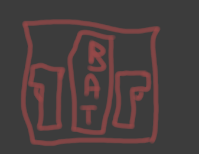
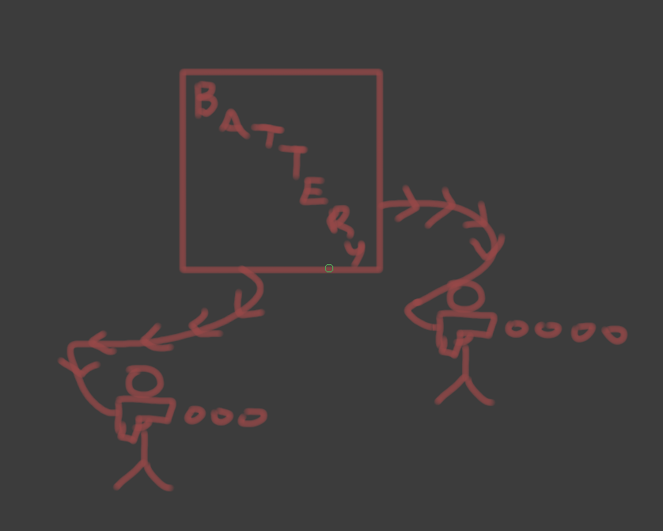

# Mish's Laser & Armory Overhaul: Tea Revisionist Edition

| Designers   | Implemented | GitHub Links |
|-------------|---|---|
| Miiish      | :x: No | TBD |
| Tea         | :x: No | TBD |
| ThatOneMoon | :x: No | TBD |
## Overview

Original document: https://docs.funkystation.org/design-proposals/lasers.html

This document outlines the potential next step forward for the laser armory, revising and expanding on parts of the
document to bring it up to date with Funky's current design philosophies while maintaining the original vision.

## Background

Ballistic weaponry from an in-universe common-sense/immersion perspective is not ideal when bullets can break windows
or station equipment, potentially killing crew and affecting productivity. The exception to this rule are Fusion weapons,
which inherently are designed to be the more aggressive option and used by security most of all rather than the crew at
large.

The purpose of this document is to unify NanoTrasen's standard weaponry in a more cohesive way, focusing on 
defensive, sensible options for suppressing large crowds of people and maintaining defensive formations with some
lower accessibility options for aggression and apprehension.

Ballistics will now also become the primary killing tools of the Syndicate (design document for them coming soon),
and these changes work to differentiate NanoTrasen-brand killing tools and the Syndicate's (from the perspective
of NanoTrasen and the crew at large: "good" versus "bad"). You can no longer blame the bullet casings in maintenance
on a trigger-happy cadet.

## Features to be added

This section will go over the revised armory in its entirety, detailing the workings and intention behind each addition.

### Defensive emplacements

1. The ACE-79 Cable-fed Laser Rifle Emplacements. 
    This is NanoTrasen's premier anti-crowd emplacement, featuring a large one-tile recharger which contains
    two laser rifles. 
    Removing a rifle from the container and inserting an ID with security access
    allows you to shoot it at a consistent rate for sustained
    fire over long periods of time. The caveat: the rifles are cable-fed, and only recharge when the sink is attached
    to a sufficient power source. 
    It will have a long do-after both to wrench and unwrench, requiring planning and strategic placement. 
    Also, it can and will explode when it has taken sufficient damage.

2. Defensive barricade emplacements - Glass, Solid & Gate. These are placeable barricade items, 
   similar to the inflatable walls. There are three versions: Glass: features a bullet-proof 
    glass pane for laser rifle fire atop a standard waist-height barricade. The glass will break under a spray of
    bullet fire, and needs to be replaced manually when fully broken. Solid: A waist-height barricade that can be vaulted
    over. Acts as a buffer to large crowds trying to rush into the protected area. Gate: Similar to the standard barricade,
    except it can be open and closed by individuals with security access.

    All barricades will be quick to deploy, but have a lengthy do-after to unwrench and will have similar structural 
    strength to airlocks.

### Standard Ranged Weaponry

1. **Roundstart sidearm** RG-2 Energy Pistol. The standard security sidearm, as implemented in Forky currently. If it still proves to be
    a toy gun, consider buffing the damage to 20 with a capacity of 12.

2. RG-14 Energy Rifle. The stock standard energy rifle of choice. Consistent, reliable and cheap. Comes with a single fire mode
   , energy bolts with a damage of 20 and capacity of 15. Still needs to be recharged.

3. P-25 ~~Phoron~~ Fusion Pistol & Canister Belt. The premier one-handed option for officers who prefer to have a hand free. 
    Comes with a belt with a holster, which functions similarly to the Backpack Water Tank & Spray Nozzle. 
   Otherwise, functions as implemented on Funky with the exception of a longer firing delay between bursts. The intent
   is for this to be security's aggressive option for raids and pushing, but with a limited lifetime and supply.

4. **Drozd Replacement** P-106 ~~Phoron~~ Fusion Rifle & Canister Backpack. The premier wieldable option. Functions similarly to the pistol, with the
    canister instead being a higher-capacity backpack with a holster. This is to account for the increased capacity and output of
    a rifle. Otherwise, functions as implemented on Funky with the exception of a longer firing delay between bursts.

### Standard Melee Weaponry

1. **Roundstart** Nightstick. Ol' huckleberry. Security's standard less-than-lethal weapon to deal with all kinds of 
    degenerates, reprobates or people you generally find disagreeable, as implemented in Funky currently.

2. Shock Stick. A stick with some added shock damage, split in the middle between blunt and shock. Can be wielded for
   some extra heft behind each swing, but requires a battery to function. Available through the riot control research.

### Specialist weapons 

1. Kammerer Riot Shotgun. Security's one and only ballistic option, implemented as it currently is. Standard ammo is beanbag ammunition,
    which will leave people concussed or in critical condition. Other ammunition options still available, such as the lethal ammunition
    and incendiary ammunition.

2.  Energy Sword/Saber. Security's new definitely-lethal melee weapon, commissioned to higher ranking officers.
    As implemented currently, with the addition of requiring specialized batteries to use. 
    Great for opening strategic holes, and is therefore the premier breaching tool.

3. **Lecter Replacement** X-88 Xray Lance. Dedicated long range/sniper weapon. Does a mixture of 12 heat/12 radiation damage, fires at
    the same rate as the energy rifle, with a capacity of 10 shots. Additionally, comes with a scope and is hitscan. Needs to be recharged.
    This weapon must be wielded to use, and slows the wielder down.

4. X-45 Energy Cannon. Security's premier heavy ordinance. Requires a specialized battery to use, which requires a lengthy do-after
    to insert into the firing port. Then, once ready, it can fire a single localized explosive fireball. This explosion does similar damage
    as a makeshift firebomb and is not designed to obliterate structures, but rather to instill fear into large crowds of people.
    This weapon must be wielded to use, and slows the wielder down.

### Visual, Flavour & Sound changes

Every single weapon will come with unique Funky sprites, projectiles and sounds in an attempt to make them feel more 
visceral and impactful.
Additionally, being hit by lasers & chemical weapons will have a chance to make people scream in pain. 
Turns out getting hit by a localized third/fourth-degree burn/chemical burn hurts quite a lot.

### Armory (Mapping)

- 1 ACE-79 Emplacement.
- 3 Energy Rifles.
- 1 Barricade emplacement Crate (containing a stack of solid barricades, half a stack of glass and 5 gate)
- 2 Fusion Pistols holstered in the belt
- 2 Fusion Rifles holstered in the backpack
- 2 Riot safes, including riot suits, helmets, shields and 2 kammerers with spare beanbag ammunition boxes
- 1 Xray Lance
- 1 Energy cannon
- Secfab

### Cargo

- The removal of the WT-550 SMG crate from Cargo, effectively deprecating the WT-550
- Replace the Enforcer crate with the Kammerer crate, which contains 2 kammerers.
- Replace the SMG & Pistols crates with the Fusion Weapons crate, which contains 1 Fusion Rifle & 1 Pistol, each holstered.
- Addition of the Xray Lance crate, which contains 1 Xray Lance.
- Addition of the ACE-79 Emplacement storage box, which contains a single ACE-79 Emplacement unit.

### Technical / Misc Tweaks

- A unified base laser projectile, as well as a unified base hitscan projectile.
- Reviewing and testing various laser weapon damage to make it feel worthwhile and impactful to use.
- Reduce the reflective vest's deflect change from 100% to 33%

### Possible (Future) Tweaks and Concerns

- Certain antag's heat & caustic resistances, most probably Nukeops and Dragons, will likely need to be tweaked down a significant margin.
- Reviewing how effective general cure & ointments are to deal with caustic damage.

## Game Design Rationale

### Maintaining Authenticity

Energy weaponry is a staple of sci-fi, and especially retrofuturistic, media. This documents solidifies its place and 
purpose within the game's universe, as well as making the appropriate visual & auditory changes to the weapons to make
them feel more viscerally impactful. Examples being the radiation damage causing vomiting and burns & caustic burns causing
the affected character to scream, and possibly double over on occasion if the damage is severe enough.

### Roundflow & Player Interaction

This revised armory promotes team-play, by establishing clear intended behaviour for each weapon. An example: 
The Lance is very deadly, but the slowdown makes it difficult to use without good positioning and cover from teammates.
Furthermore, these changes largely gears security for crowd control through emplacements and crowd control tools such as
the cannon. This moves security further away from antagonist-oriented design and instead designs an armoury intended to deal
with riots and outright revolution, while still faring admirably against outside threats with coordinated play.

Furthermore, specialized weapons are sparse and expensive. This means that selecting the correct weapons or emplacements
becomes more important and gives security the chance to develop an armory around the threats they are facing in a given round,
rather than the armory being overstocked to deal with any threat there may be.

### Maximizing Roleplay Potential

The revised weapons, in particular the specialist ones, are designed to be devastating with drawbacks that bring them in
line and make them feel more tactile and intentional. The armory generally moving away from fully automatic weaponry further
reinforces the idea of tactile and intentional gameplay and roleplay. 

## Technical considerations

All the following changes should be possible with .yml and mapping changes.

# This is step 1 of a 3 step plan. Step 2 will focus on crew-oriented options, and step 3 will focus on the syndicate.
