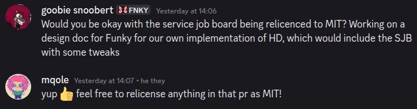
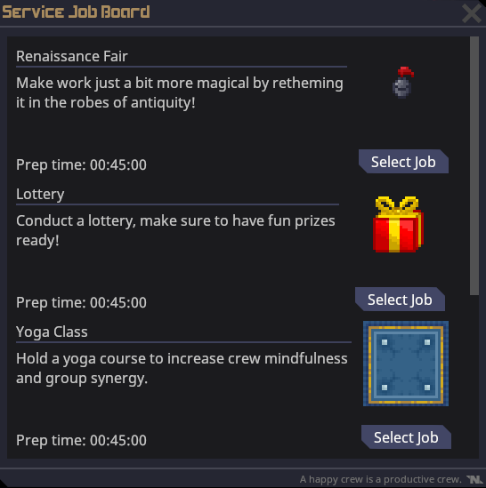
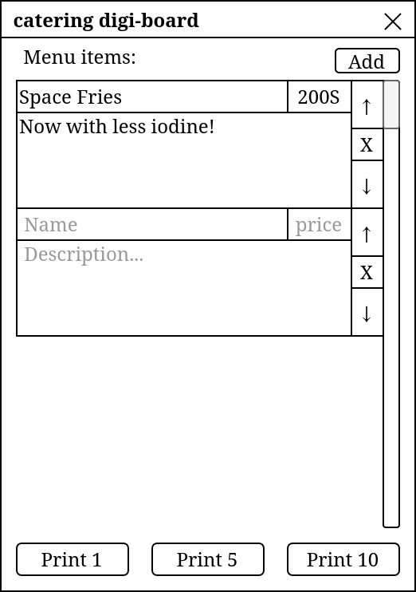

# Logistics & Service Restructuring

| Designers | Implemented | GitHub Links |
|---|---|---|
| SOP Workgroup, Doc Authored by pirakaplant | :x: No | TBD |

## Overview

This document outlines changes that will be made to the Logistics (formerly known as Cargo and/or Supply) and Service departments. This includes reassigning jobs between the two departments, removing extraneous Service jobs, and a new command member to properly organise Service instead of the HOP. This new command member, the Hospitality Director, will also have some new unique items outlined here.

## Background

Initially, Taydeo provided the SOP Workgroup with [a draft for a new command structure](https://discord.com/channels/1276640157511979008/1484259495130566656/1497052780743889097), drawn from admin discussion on the matter. While this encompassed a departure from our current system in multiple aspects, the relevant aspect here is a "Logistics Officer" or "Mess Officer" (the term is used interchangeably to refer to a proposed leader of the Service department separate from the Head of Personnel) serving under the Quartermaster, similar to how the Warden serves under the Head of Security while holding authority of their own in certain areas. The job was also referred to as the "Maitre d'Hotel", "Majordomo", and "Butler" before we settled on "Hospitality Director", borrowing the title from Impstation.

Since this was posted, by the next SOP Workgroup Checkpoint ([Checkpoint 5](https://discord.com/channels/1276640157511979008/1484259495130566656/1498202108925575351)), debate was held over making the Hospitality Director a command job proper. Tay was initially resistant to the idea, changed their mind later, referring to it as ["a good proposal"](https://discord.com/channels/1276640157511979008/1484259495130566656/1498181833374961675).

In the meantime, I (pirakaplant) was assigned to writing a design document for these changes on the [SOP Workgroup PR Work Board](https://discord.com/channels/1276640157511979008/1484259495130566656/1497783492216492043). This is that document.

## Features to be added

### Logistics Department

Logistics is the new name for the Cargo/Supply department, to indicate a broader range of responsibilities on the station.

Botanists and Janitors are now part of the Logistics department, and answer to the Quartermaster. Hydroponics areas will be mapped closer to the cargo bay where possible, while janitorial areas can remain untouched.

### Hospitality Director

The Hospitality Director is a new job responsible for coordinating the Service department, taking over the duties of the Head of Personnel in that area.

- The Hospitality Director is a command job, and starts mindshielded like all other command jobs.
- The Hospitality Director has their own office near the Service area, with the Service communication console (HOP will no longer have theirs) and Service job board (see below).
- Hospitality Director requires 2 hours of Service Worker, 2 hours of Bartender, 2 hours of Chef, and 8 hours of total Service department playtime to unlock.

Aesthetically, clothing and decor for the Hospitality Director should focus on a "fine dining" or "first-class hotel" aesthetic to indicate their role and superiority to other members of the Service department. For example, their "default" outfit would ideally be a buttoned uniform and pillbox hat, akin to a valet.

### Service Job Changes

There will be multiple changes made to Service jobs themselves. In alphabetical order:

**Boxer:** This job will be recontextualised, renamed the "Fitness Instructor", and made a part of the Service department proper, with a dark green icon, instead of being a "Civilian" job. Changes to the job itself would be minimal besides changes to job titles, loadouts and overhauling some boxing areas to put less of a focus on the ring itself and more on.

**Chaplain:** Will be made part of the Service department proper, with a dark green icon.

**Musician:** Will be made part of the Service department proper, with a dark green icon.

**Service Worker:** This will be recontextualised into more of a "waiter" job, and the bulk of their work will be communicating orders and serving food to customers of the Service area. Service Workers can still shadow other Service jobs and fill in when needed, but they no longer start with Bar or Kitchen access.

**Zookeeper:** Will be removed as the position does not contain enough content, roleplay potential, or even player interest for a whole job. The zoos themselves (on the maps that have them) can still exist for players who want to opt into the role of taking care of the animals there.

### Service Event Console

*(This section is directly inspired by the implementation of the "Service Job Board" on Impstation.)*

The Service event console is a computer console located in the Hospitality Director's office. It allows them to schedule events for the Service department to perform. The options are randomised, with five available at once. Each event has a set preparation time.

When an event is selected from the console, it sends the event name, as well as the time available to prepare the event, over the Service radio channel. When that time has elapsed, a Service announcement is automatically sent across the station, alerting personnel so they can participate in the event as they please.

When it comes to the selection of events available on display, there should be at least some cynical, corporate, Seriously Silly options to pick (and enough to make them being the *only* ones available a possibility).

### Catering Digi-Board
The catering digi-board is a device that spawns in the Hospitality Director's locker. Like the requisition digi-board, it can be clipped to the belt and contains the same paper storage as a clipboard.

When interacted with, the digi-board brings up a UI that allows them to design a menu with an interface for adding, removing, and reordering items. Each item has a name, description, and [scrip](https://docs.funkystation.org/design-proposals/scrip.html) cost. The UI also features buttons for printing a single menu, printing five menus, and printing ten menus. Printing a menu sends it to the digi-board's inventory, provided there is space still remaining (excess menus get dropped on the floor).

A menu is a writable piece of paper which automagically generates a stylised header and all menu items formatted and spaced on it when printed. It otherwise has no mechanical differences to normal paper.

## Game Design Rationale

### Departmental Domains

Throughout the history of Space Station, what is now known as the Service department (on most servers) was mostly treated as a catch-all department for anything that did not fit neatly into other departments. Given that the overall hierarchy of the station is in the process of being rearranged, it's worth codifying what Service *does* as a department. It doesn't initially come across as a *vital* service the same way that Medical, Engineering, and Security does. And unlike Cargo and Science, there's no major financial gain from it.

As detailed further below in "Maintaining Authenticity", discussion has narrowed Service specifically into being a "bread and circuses" department, which can not only fit neatly into our depiction of Nanotrasen, but is also a solid design direction already supported by most of the jobs within it.

As a result of this, several jobs are being moved or restructed to fit this specific vision. Botanists now work in Logistics because growing plants fits the department that produces materials for other departments better than this new definition of Service. Likewise, the Janitor going around and cleaning chemical spills and replacing cracked lightbulbs is more of a logistical job than one that appeases and distracts crew from their material conditions, so it's also moved out of Service. Other, more niche jobs are removed or broadened to make sense as a position that Nanotrasen would hire for the department.

### Seriously Silly

Ideally, a Funky take on the Hospitality Director's events would help inject our particular brand of humour into the narrative. Attending a birthday party for the evil megacorporation that exploits you is not only something that companies do *in real life*, but also lends itself to inevitable hilarity when someone screws up and corporate makes that molehill into a mountain.

### Maintaining Authenticity

> Q: Which of the following items might help an HR professional drive employee retention and success?
> 
> ☑ A ping-pong table.
> 
> ☒ Additional responsibilities.
> 
> ☒ A raise in pay.
> 
> — A quiz for HR personnel

A corporation like Nanotrasen needs to rely on "bread and circuses" to maintain appeal among its workers. After all, worker loyalty is a hot topic in the real-life business world and is typically treated in a similar manner. While NT employees don't exactly have anywhere else to go, the possibility of striking and other retributive and distruptive acts is an issue that Nanotrasen would want to keep in check.

At the moment, Service is a department that is mostly left to its own devices, as the Head of Personnel is busy with their own duties. Giving Service its own department head, whose responsibilites are in line with their department's, is something that Nanotrasen would do.

### Maximising Roleplay Potential

#### Service Events

Service's events provide a prompt for players to get together in ways they otherwise would not, and further cement Service as a department that facilitates social interaction across other departments.

## Roundflow & Player interaction

### Hospitality Director

The Hospitality Director, unlike the previous incarnation of the Head of Personnel, is supposed to play a more active role in the organisation of the Service department. This is achieved by giving them the tools to do so:

- The Service event console codifies character-run events as a part of Service's gameplay, making them more likely to happen than they do in their current state. The preparation for such an event is a good excuse for the Hospitality Director to excercise their power.
- The catering digi-board simplifies the process of making menus in the game, something that was also already possible, but tedious for most players. By putting it into the hands of the Hospitality Director, it encourages them specifically to pick out the menu for their department to serve.

### Service Event Console

The Service event console will likely be used around 1-2 times a round, if there is a Hospitality Director in the game. This will be enforced with relatively long preparation times for each event (which could be between 30 to 45 minutes for most events).

# Technical Considerations

## Service Event Console

The code itself can be ported from Impstation. mqole (the creator of the code) has given permission for it to be relicenced as MIT.

### UI

*(Screenshot taken from Impstation for demonstration purposes.)*

## Catering Digi-Board

The catering digi-board would require new systems to handle printing the menus, as well as a new BUI (see the mockup below).

### UI Mockup

