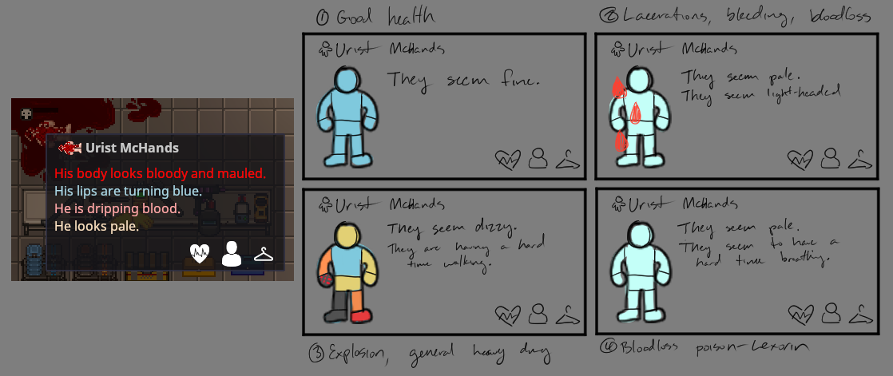
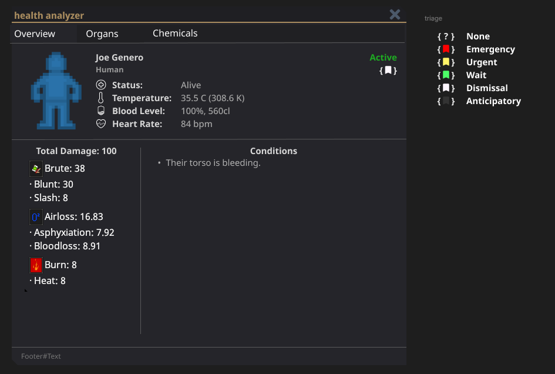

# Health Analyzer Redesign

| Designers  | Implemented | GitHub Links |
| ---------- | ----------- | ------------ |
| correspond | :x: No      | TBD          |
## Overview

One of the Medical department's largest flaws is its insistence on being a very direct approach to health and wounds. There is a verifiable existence of a "health bar" for players and bodies as whole, and the department largely focuses on simply matching the right types of numbers to the correct chemicals. Despite the department being flavored to be based in semi-reality, there is no particular difference between, say, using a chemical to heal a wound versus drinking an HP potion. 

Ultimately, this makes the gameplay loop of the department as a whole very boring: you match the right numbers to the right tool. This is particularly seen in the usage of the MedTek and medical scanners. Currently, players are able to see the exact type of damage and then use the according solution. Rather than continuing down this pathway, this proposes to adjust the way that medical doctors interact with the health system as a whole: doctors should use symptoms to diagnose wounds, then treat accordingly. 

One of the first steps in order to accomplish this is to redesign the gameplay loop associated with *diagnosing* patients. MedTek scanners, health inspections, etc. are the primary object to be redesigned within this proposal. 

## Background

[Baymed](https://baystation.xyz/index.php?title=Guide_to_Medicine#Diagnostics) is the primary inspiration behind the actual implementation and gameplay loop with this proposal. This inspiration is really more abstract, though, so it likely won't end up actually looking very inspired to Baymed. The main idea is that there should be a more in-depth medical system, and looking at actual hospital practices is also fine for inspiration. 

## Proposed Gameplay Loop

The proposed gameplay loop is split into three sections: 
1. An initial, surface-level inspection in order to triage the patients
2. A slightly more in-depth inspection to know the patient's injuries or ailments
3. If necessary, a specialty analysis to address more obscure ailments (for example, missing/injured organs, poison analysis, etc)

## I. Initial Inspections

Currently, medical personnel know who to prioritize because of the medical HUD. Any damage is simplified into a health bar and icon denoting alive, crit, or dead above their head. The current usage of the HUD, allowing for quick triage, should be retained, but it should be reflavored to move away from the contextualization of health being a "bar" or "pool" of damage numbers. 

Similarly, there should be some sort of way to encourage a step between initial triage and diagnosing a patient. Triage is primarily for high-intensity situations where doctors may not be able to do an in-depth examination, rather focusing on making sure as many patients as possible are back up on their feet. When the situation permits, we should encourage doctors to thoroughly inspect their patient and possibly roleplay with them (ex. "How are you feeling?" or "What happened?"). 

Option A). Simplifying the HUD health bar to reflect the same health states shown in the primary hud: Good, Okay, Poor, Bad, Bad! (about to crit), Crit, and Dead. 

This gives a similar amount of information as health bars, it just isn't as exact as it currently is. While it solves the issue of reflavoring the design to better match the goals of this proposal, it does not entirely address the core problem. These states are still based off of pools of damage. This does not communicate any sort of "advanced" damage such as missing or broken limbs, which we possibly *would* want to communicate clearly and instantly. Additional sub icons for amputations or broken limbs should be considered (when the support for such is properly there).

Option B). Redesigning the medical inspect/shift-click menu to better communicate visible wounds.

Currently, the medical shift-click menu shows a list of color-coded sentences, displayed based on what kind of damage the entity has. This menu, hidden behind two sublayers (shift-click, then press the medical icon), is often ignored by players due to it being a very unintuitive menu that is objectively worse than other options (scanning with a health analyzer). The phrases become long and unwieldly quickly, but they also don't give very much information. There is no way to tell if someone is poisoned, irradiated, etc from this menu. 
 
This menu should be redesigned to accomplish two tasks: immediately show any visible damage quickly and give hints to less visible information (such as poisoning). A visual aide, similar to the body dolls, can be used to accomplish communicating the visible damage. A base body doll would have certain states overlaid on top, communicating if a limb is healthy, broken, amputated, or if there are any wounds. Overlays for bleeding, bloodloss, and rot would also be necessary. The text should be repurposed to show symptoms of invisible wounds. 

For example, "they are sweating profusely," "they are salivating," or "they are shaking" can all be ways to communicate that a patient is being poisoned (specifically by a poison targeting the nervous system, toxins should later get a pass to actually define how they poison people later). The symptoms can be made as general as necessary, such as "they seem disorientated" or "they seem feverish" to denote radiation poisoning. 

This option, however, needs a lot more thought put into it before it can truly be redesigned. How do we ensure that this menu does not "powercreep" doctor-specific equipment, such as health analyzers? Should we tie this level of detail to having the medical HUD equipped, or should it be an inherent skill to doctors? How do we purposefully and clearly communicate the difference between types of visual damage, such as cold, burns, lacerations, blunt, pierce, without these visuals becoming too graphic? 

## II. In-depth Diagnosis

This step would actually use the health analyzer, along with any other possible tools we wish to give functionality to (the penlight or stethoscope). The health analyzer should be redesigned to give a *good overall analysis* of a patient, at the cost of being *unable to fully identify special ailments.* Overall, the analyzer should favor information that is easy to visually identify and treat, such as brute and burn damage, and only hint towards invisible injuries, such as poisoning or organ damage. 

Information that points towards more complex treatments should be limited. For example, only medical chemicals should show in the bloodstream. Otherwise, "unknown reagent detected" should show up. 

### III. Specialty Symptoms 

In the case that there is a need for more in-depth information, doctors should then swap from the basic handheld scanners to full body scanners. These scanners should be specialized based on the information hinted at in the handheld scanner. All of this damage should be *not immediately life threatening,* as splitting up this process forces medical to take more time to see the issue. These scans should also not take very long to do, as the act of splitting them up into different machines slows them down considerably. 

For example:
- Full body x-ray scanners to diagnose damaged organs, bones, or internal bleeding
- Toxicology tests to see traces of poisons and currently ingested reagents
- Biopsy scans to see any genetic damage

## Game Design Rationale

my rationale is i already wrote 1k+ words and im genius and should always be followed

## Technical Considerations

- ui code
- medical system being good
